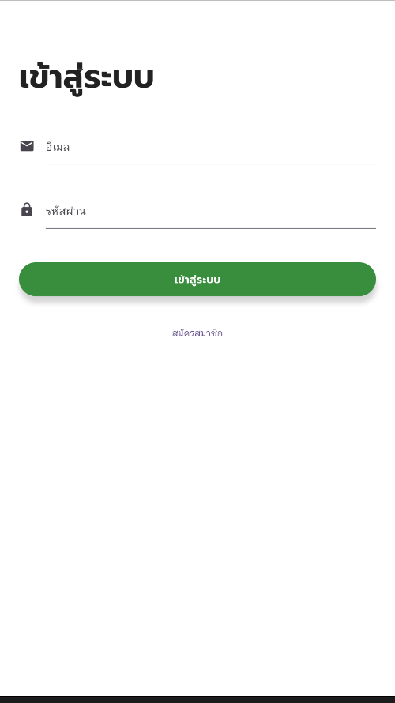

# Delivery Application

A cross-platform mobile delivery application built with Flutter. It provides dedicated interfaces for both riders and customers, using Firebase for database operations and real-time status updates.

## User Interface Demo

### 1. Authentication & Registration Flow
We provide a seamless onboarding experience with distinct registration pathways for users and riders.

| Account Type Selection | User Registration | Rider Registration | Login Screen |
| :---: | :---: | :---: | :---: |
|  |  |  |  |
| Choose between User and Rider roles | Register name, email, phone, and profile photo | Register vehicle plate details along with account info | Log in to the application |

---

### 2. Main Dashboards
Dedicated home screens tailored specifically to the actions of the user and the rider.

| User Home Dashboard | Rider Home Dashboard |
| :---: | :---: |
|  |  |
| Create delivery jobs, view history, and track active orders | Browse available jobs, accept orders, and manage active deliveries |

---

### 3. Delivery Creation & Real-Time Tracking
Real-time tracking and mapping powered by Firebase Firestore, keeping both parties updated on the order status.

| Create Delivery Order | Map Tracking (User View) | Map Routing (Rider View) | Order Details |
| :---: | :---: | :---: | :---: |
|  |  |  |  |
| Create new jobs with location coordinates and item details | Track rider position on the map in real-time | Real-time navigation map and route to recipient | View job summary, timeline, and delivery logs |

---

## Features

* **User Features**:
  * Registration and login interface.
  * Create new delivery jobs with location and item details.
  * View delivery history and track active orders in real-time.
* **Rider Features**:
  * Registration and login interface.
  * Job preview panel to browse available deliveries.
  * Accept delivery jobs and update status (picking up, delivering, completed).
* **Firebase Integration**: Uses Cloud Firestore for real-time data synchronization and tracking.

## How to Run

### Prerequisites
* Flutter SDK installed.
* An active emulator/simulator or physical device connected.

### Compilation and Execution

1. Get the package dependencies:
   ```bash
   flutter pub get
   ```

2. Run the application:
   ```bash
   flutter run
   ```
